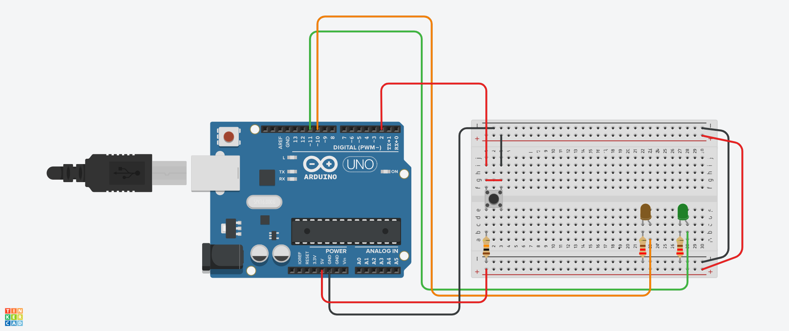
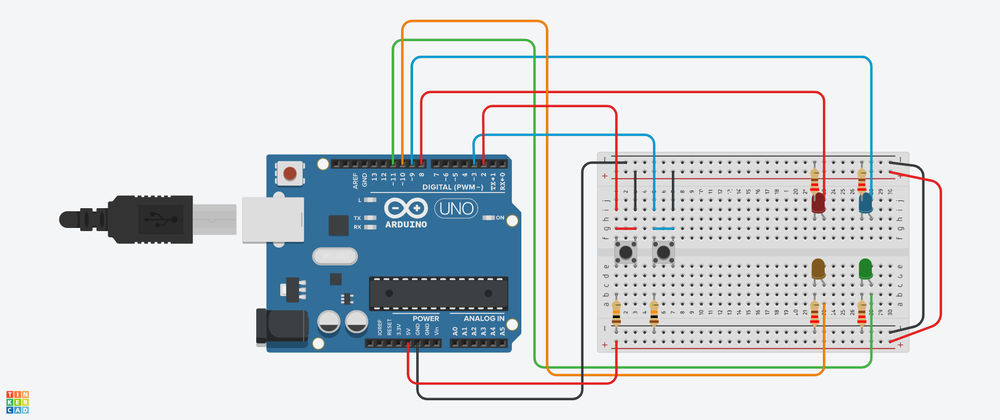

# Practise for Final : Finite State Machine Sample
> [Finite State Machine Number 1 Code](./Finite-State-Machine-Number1.ino)

> [Finite State Machine Number 2 Code](./Finite-State-Machine-Number2.ino)

